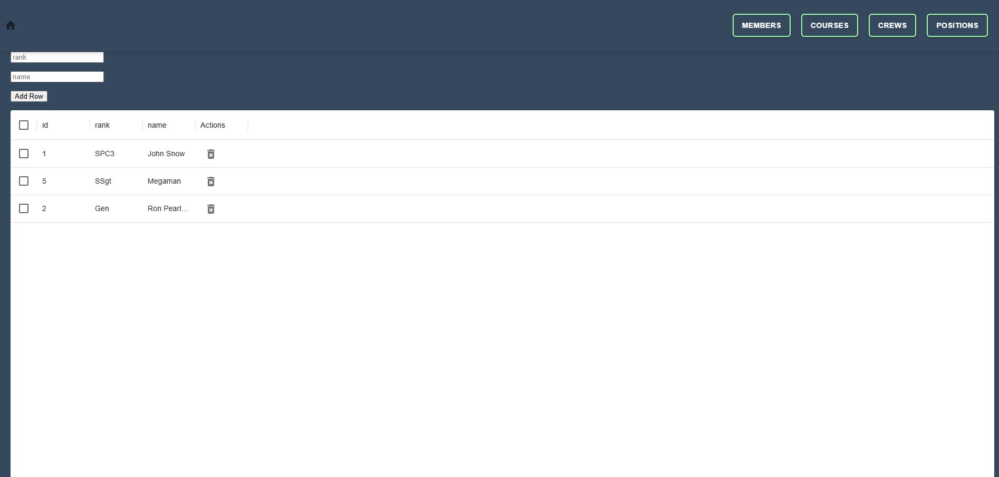
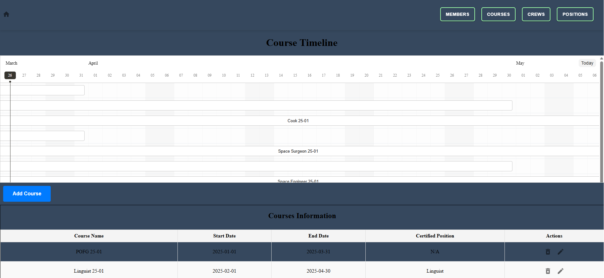

# Malicious Vanquishers of Evil (MVOE) Scheduling Tool

**MVOE Scheduling Tool** vanquishes the evil of difficult scheduling. With computing powers combined you are now able quickly and easily inprocess new members to your squadron by adding them to the roster on the **Members** page.

Once a new member is added, you can assign them to their training pipeline for one of their eventual crew positions: **Crew Commander**, **Purveyor of Fine Goods**, **Linguist**, **Cook**, **Deckhand**, **Space Surgeon**, or **Engineer**. You can also check out the **Positions** page to get a description of each crew position.

To create a new courses, check out the **Courses** page and click the **Add Course** button to put a new course on the timeline. If you need more detail, or detail at a glance, scroll down to the **Courses Information** section. Also in that section, you can delete or edit a course by clicking the respective icons!!

## Problem Statement

Unit schedulers are struggling to deconflict schedules between courses and crew rotations due to the complex and extensive course requirements. Courses range from 2 to 6 months, and the current reliance on three separate systems for tracking availability leads to scheduling errors and delays, impacting mission readiness.


Our solution is to create a crew scheduling tool that enables scheduling managers to visualize ongoing and upcoming courses and track availability based on course completion. This tool will allow schedulers to efficiently build crews for different time periods by ensuring individuals meet the necessary course requirements for their assigned positions.

---
## Prerequisites

- Node.js (v16 or newer)
- npm
- PostgreSQL
- Git
- Docker

## 🚀 Run Locally

### 📌 Prerequisites

Ensure you run the following command to install required dependencies:

-   npm install

### 🔹 Clone the repository

```bash
  git clone https://github.com/curtisbonham/SDI-Project-3
```

## User Stories/ERD/Wireframe

[Figma](https://www.figma.com/board/tFoJ139YpyI3SxZGz8hjRo/Project-3?node-id=40-118&t=g3NpV4sDbmqEVQzO-0)

## Screenshots




## Authors

-   [Curtis Bonham](https://github.com/Adam-Brace)
-   [Joshua Gore](https://github.com/Adam-Brace)
-   [Camilo Cueto](https://github.com/Adam-Brace)
-   [Jackie Luu](https://github.com/Adam-Brace)
-   [Isaiah Aguirre](https://github.com/Adam-Brace)

